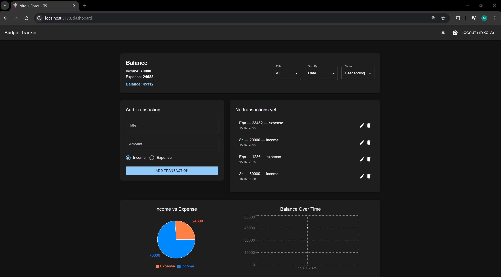

# Budget Tracker

A simple fullstack budget tracking application to manage your income and expenses.

---

## Description

This project is a budgeting app built with React (frontend) and Express + MongoDB (backend).  
It supports user authentication with JWT, CRUD operations for transactions, filtering and sorting, analytics charts, and an admin panel powered by AdminJS.

---

## Features

- User registration and login with JWT authentication  
- Add, edit, delete income and expense transactions  
- Filter and sort transactions by date or amount  
- View analytics with balance over time  
- Admin panel to manage users and transactions  

---

## 🔧 Technologies Used

- **Frontend:** React, TypeScript, Material-UI, Axios  
- **Backend:** Node.js, Express, MongoDB, Mongoose, JSON Web Tokens, AdminJS  
- **Tools:** TypeScript, Nodemon, ts-node, dotenv  
---


## ⚙️ Getting Started

### Clone the repository

```bash
git clone https://github.com/grynevych89/Budget_Tracker-React-Express-MongoDB-.git
cd budget-tracker
```

### Install dependencies
```bash
# Backend
cd backend
npm install

# Frontend
cd ../client
npm install
```

### Configure environment variables
Create `.env` files in `backend` folder. 
Example for `backend/.env`:

```env
PORT=5000
MONGO_URI=mongodb://localhost:27017/budget-tracker
JWT_SECRET=your_jwt_secret_key

ADMIN_EMAIL=admin@example.com
ADMIN_PASSWORD=admin_password
ADMIN_COOKIE_SECRET=some_secret_for_cookies
```

### 🚀 Run servers
Open two terminals:

```bash
# Backend
cd backend
npm run dev

# Frontend
cd ../client
npm start
```

### Admin Panel
AdminJS is available at:  
[http://localhost:5000/admin](http://localhost:5000/admin)

Login with the credentials defined in your `.env` file (`ADMIN_EMAIL`, `ADMIN_PASSWORD`).

---

### Budget Tracker
You can try the app locally at:  
[http://localhost:5173](http://localhost:5173)